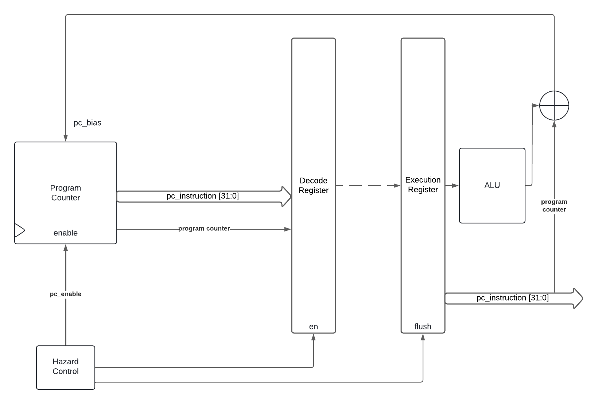
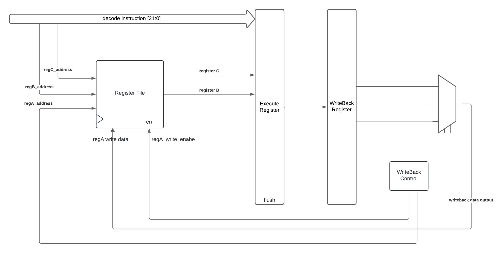
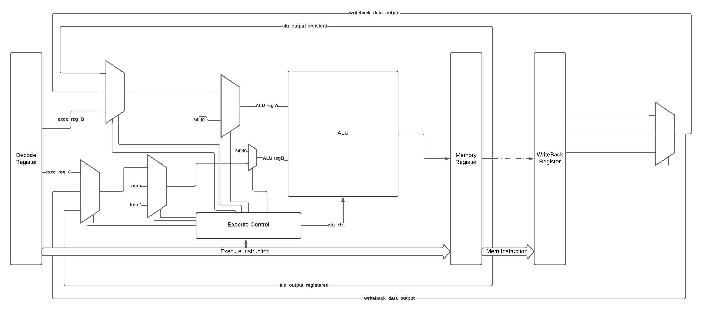
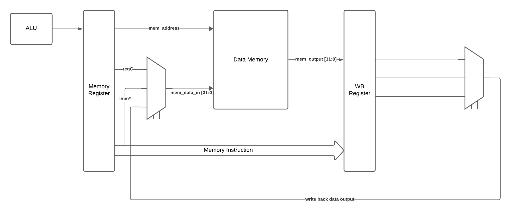
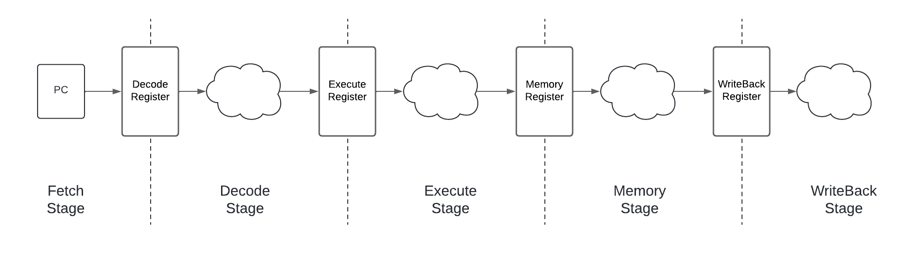
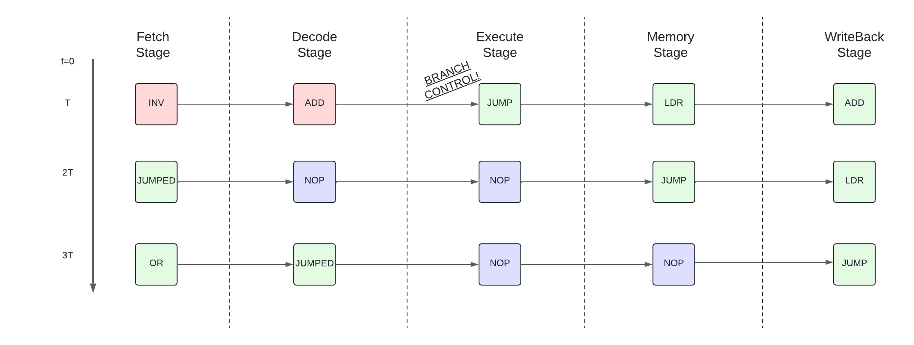
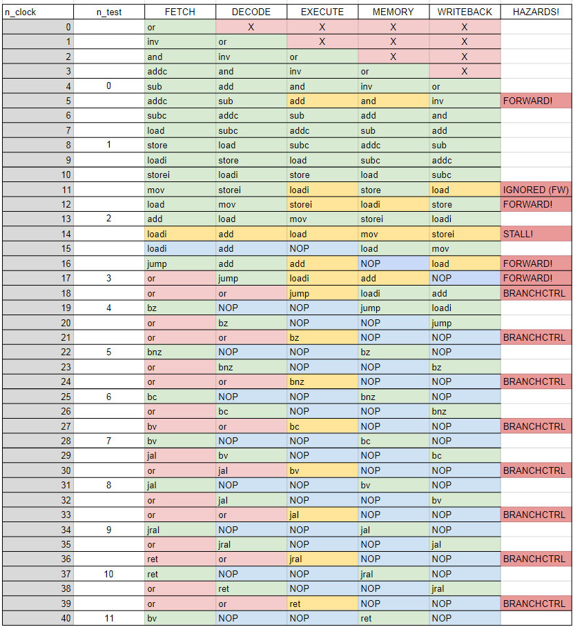

# Multicycle RISC testbench Documentation

**Link to testbenchs**

Random: https://www.edaplayground.com/x/hXSs

Target: https://www.edaplayground.com/x/7KcW

## Block Diagrams
Important aspects of every stage.
### **Fetch Stage Diagram:**
Fetch stage keeps the instruction memory inside and distribute it throughout the pipeline. It has a *pc_bias* port which makes it possible to load a program counter value, and it also counts with an *pc_en*, which allows the following instruction when rising clock edge comes.
In the diagram it is detailed that *flow control* instructions, which are capable of taking control of the following instruction, are detected and resolved in Execute stage. 


### **Decode Stage Diagram:**


### **Execute Stage Diagram:**
Execute stage mostly computes operations whenever its needed. Usually its inputs are driven from decode stage, but in *movement* or *flow control* operations, *Imm*, *Imm* *, zeros, and forwarding inputs need to be included.


### **Memory Stage Diagram:**
Memory stage is simple. When data memory needs to be written its input can either come from C register (*store* instruction) or from the Imm* extension register (*storei* instruction). So, input MUX decides whether to choose regC which goes throughout the pipeline, Imm* which can be selected from the current instruction, or in the special case (forwarding) where the previous instruction intended to write C register, then it can come frome the WriteBack Stage. On the other hand, mem_address which is used for writing and reading instructions, and it always comes from alu output. 


### **WriteBack Stage Diagram:**
Write back output changes in the following way:
- wb_output = mem_output  in *load* instruction.
- wb_output = *Imm* * in *storei* instruction.
- wb_output = *pc+8'd1* in case of *jal* or *jral* instructions.
- wb_output = alu in all the other cases.


### **Final Pipeline**



---
### **Project Structure**
```
└── 📁multicycle
   └── top_multicycle.v
      └── defines.v
      └── alu_multicycle.v
      └── memory.v
         └── mem.hex
      └── program_counter_multi.v
         └── pc_mem_RANDOM.hex
         └── pc_mem_TARGET.hex
         └── pc_mem_target_multi.hex
      └── register_file_multi.v
         └── register_mem.hex
         └── register_mem_aux.hex
```
**Top Module:**
``` verilog
module top_multicycle #(
    parameter MEMORY_FILE   = "mem.hex",
    parameter PC_FILE       = "pc_mem_target_multi.hex",
    parameter REG_FILE      = "register_mem.hex"
   )
   (
    input   wire                            clk,
    input   wire                            rst_n,

    //Debugging signals!
    //.
    //.
   );
```

**Alu Module:**
``` verilog
module alu_multicycle
    #(
        parameter NB_REGISTERS  = 34,
        parameter DATA_WIDTH    = 32
   )
   (
        input   wire [2:0]                   i_alu_ctrl, //Controls the operation of alu
        input   wire [NB_REGISTERS-1:0]      i_data_A,   //ALU in A
        input   wire [NB_REGISTERS-1:0]      i_data_B,   //ALU in B

        output  wire [NB_REGISTERS-1:0]      o_data      //ALU out
    );
```
the possible operations that ALU can do are:
``` verilog
   parameter ADD       = 3'd0;
   parameter SUB       = 3'd1;
   parameter ADDC      = 3'd2;
   parameter SUBC      = 3'd3;
   parameter ALU_OR    = 3'd4;
   parameter ALU_AND   = 3'd5;
   parameter ALU_INV   = 3'd6;
   parameter EXCEPTION = 3'd7;
```

**Memory Module:**
```   verilog
 module memory 
    #(
        parameter MEM_WIDTH  = 8,
        parameter DATA_WIDTH = 32,
        parameter ADDR_WIDTH = 8,
        parameter MEM_INIT_FILE = "mem.hex"
    )
    (
    input   wire                            clk,
    input   wire                            rst_n,          //disabled
    //Input writing data
    input   wire                            i_wenable,      //write enable
    input   wire    [0:ADDR_WIDTH-1]        i_address,      //write address
    input   wire    [0:DATA_WIDTH-1]        i_data,         //write data
    //Outputs
    output  wire    [0:DATA_WIDTH-1]        o_data          //mem output
    );
```

**Register File Module:**
```   verilog
 module register_file_multi
    #(
        parameter REG_WIDTH     = 34,
        parameter ADDR_WIDTH    = 5,
        parameter MEM_INIT_FILE = "register_mem.hex"
    )
    (
        input   wire                        clk,
        input   wire                        rst_n,

        //Inputs:
        //REGISTER A
        input   wire [ADDR_WIDTH-1:0]        i_address_reg_a,     //address A
        input   wire                         i_wenable_reg_a,     //write enable A
        input   wire [REG_WIDTH-1:0]         i_writedata_reg_a,   //reg A write data
        //REGISTER B AND C
      	input   wire [ADDR_WIDTH-1:0]       i_address_reg_b,  //address B
      	input   wire [ADDR_WIDTH-1:0]       i_address_reg_c,  //address C

        //OUTPUTS
        output  wire [REG_WIDTH-1:0]         o_data_regb,   //register B
        output  wire [REG_WIDTH-1:0]         o_data_regc    //register C
    );
```

**Program Counter Module:**
```   verilog
 module program_counter_multi #(
        parameter MEM_INIT_FILE = "pc_mem_target_multi.hex"
    )
    (
    input   wire                clk,
    input   wire                pc_en,                //pc enable
    input   wire                bias_en,              //bias enable
    input   wire [7:0]          bias,                 //load pc
    output  wire [31:0]         instruction_output,   //instruction
    output  wire [7:0]          program_counter       //pc
);
```

---

# ALU operations by instruction
|Operation|ALU operation|Operand 2|Operand 3|Note|
|---------|---------|---------|---------|------|
|**MOVEMENT**   |
|**load**       |   0(+)       |Rb       |Imm*  |   Mem_addr
|**store**      |   0(+)       |Rb       |Imm   |   Mem_addr
|**loadi**      |   0(+)       |Imm*     |      |   WB_output
|**storei**     |   0(+)       |Rb       |      |   Mem_addr
|**mov**        |   0(+)       |Rb       |      |   WB_output
|**LOGIC**      |
|**or**         |   4(or)       |Rb      |Rc    |   WB_output
|**inv**        |   6(~)       |Rb      |Rc     |   WB_output
|**and**        |   5(&)       |Rb      |Rc     |   WB_output
|**ARITHMETIC**   |
|**add**       |   0(+)       |Rb       |Rc     |   WB_output
|**sub**       |   1(-)       |Rb       |Rc     |   WB_output
|**addC**      |   2(+c)      |Rb       |Rc     |   WB_output
|**subC**      |   3(-c)      |Rb       |Rc     |   WB_output
|**FLOW CONTROL**   |
|**jump**      |   0(+)       |Rb       |0      |
|**bz**        |   0(+)       |Rb       |Imm    |
|**bnz**       |   0(+)       |Rb       |Imm    |
|**bc**        |   0(+)       |Rb       |Imm    |
|**bv**        |   0(+)       |Rb       |Imm    |
|**jal**       |   0(+)       |Rb       |Imm*   |
|**jral**      |   0(+)       |Rb       |Imm*   |
|**ret**       |   0(+)       |Rb       |0      |


# Target Testbench
The following documentation corresponds to the work done in the target testbench.
### Instructions executed
|Operation  |Operand 1  |Operand 2  |Operand 3|
|---------  |---------  |---------  |---------|
|**or**     |31         |0          |1
|**inv**    |31         |2          |
|**and**    |31         |4          |5
|**add**    |31         |31         |30
|**sub**    |31         |28         |29
|**addc**   |31         |27         |26
|**subc**   |31         |25         |24
|**load**   |31         |23         |22
|**store**  |21         |20         |19
|**loadi**  |31         |63         |
|**storei** |31         |127        |
|**mov**    |31         |15         |
|**load**   |31         |1          |2
|**add**    |31         |31         |2
|**loadi**  |30         |30         |
|**jump**   |2          |           |
|**or**     |31         |0          |1
|**or**     |31         |0          |1
|**bz**     |1          |0          |2
|**or**     |31         |0          |1
|**or**     |31         |0          |1
|**bnz**    |2          |1          |2
|**or**     |31         |0          |1
|**or**     |31         |0          |1
|**or**     |31         |0          |1
|**bc**     |1          |30         |1
|**or**     |31         |0          |1
|**bv**     |1          |30         |0
|**jal**    |31         |3          |
|**or**     |31         |0          |1
|**or**     |31         |0          |1
|**jral**   |31         |0          |2
|**or**     |31         |0          |1
|**ret**    |18         |           |

<u> Observe the following: </u>
- In *ADD* operation (PCF=5 in Fetch Stage, PCE=3 in Execute Stage) a Forwarding Hazard should arise, since register 31 is inteded to use, which has been prevously written.
- In *LOADI* operation (PCE=9) a Forwarding Hazard should arise, since Imm*=63 which makes Rc field be 5'b11111. This goofs Hazard unit into thinking that Rc field is 31st register and 2 operations before, in *LOAD* operation, 31st register was intended to be written (detected in writeback stage). This wont make any change, since ALU control will handle it, ignoring hazard.
- In *STOREI* operation (PCE=10) a Forwarding Hazard should arise, since its intended to use Rb=31 register to access memory, but previous operation *LOADI* tries to write register 31. A 63 should be passed.
- Second call to *LOAD* operation (PCE=12) was introduced to force a Stall Hazard. *LOAD* intends to write 31st register from memory but in Decode Stage is detected that next operation will need that 31st register to do an ALU computation. This will force the pipeline to stop for a while until memory is addressed, and in next clock a Forwarding is made from WriteBack Stage up to Execute Stage.
- Last *RET* instruction goes back to *BV* instruction, thus RISC enters a loop from 19th instruction and on.

### Hazards
<u> How hazards are detected? </u>
1. **FORWARDING:** forwarding is asserted high whenever the Rb or Rc field of instruction in Execute Stage is the same as the Ra field in Memory or WriteBack Stage. This means that whenever Imm* use is intended, encompassing Rc field, a hazard may arise. These special cases are addressed in control unit.
2. **STALL:** stall hazard is arised when in Memory Stage, a *LOAD* instruction is detected and the destination address is the same as an Rb or Rc address in Execute Stage. This will flush Decode Stage Register.
3. **BRANCH:** branch control hazard is arised whenever a FLOW CONTROL instruction is detected in the Execute Stage. This will flush Decode and Execute registers, and stall Decode Register.
   


### Target testbench executed
These are the instructions tested in target_testbench. The whole system, signals and waveforms, instructions, and operations, were followed and checked. The following diagram may help as a road map:
- In green, instructions that shall be executed.
- In yellow, instructions that arise hazards. When a hazard occur, the stages involved are highlighted, indicating for example the origin and destination of a forwarding hazard.
- In blue, instructions, flushes, or actions executed in order to solve hazards.
- In red, garbage instructions which shouldnt be executed


Some remarks about the comparisons executed:
1. **TEST N0 - 4th clock**:
   - Memory: input should be 32'hffffffff since it comes from regC, *addc* is in decode stage addressing regC -> reg[30] = 32'hfffffff
   - Decode: *regA* input data is 1 as *or* operation is on WriteBack stage.
2. **TEST N1 - 8th clock**:
   - Memory: input should be 32'h16 since it comes from decode stage *regC*. *load 31,23,22* is in decode stage addressing regC -> reg[22] = 32'd22 = 32h16
   - Decode: *regA* input data is 34'h30000001c as *subc* operation is on WriteBack stage. *subc* operation makes 32'h0000001c - 32'hffffffff - 32'd1, so the result is a *1c* with underflow, in the MSB.
3. **TEST N2 - 13th clock**:
   - Memory: memory addr is 42 since two clocks before *load* instruction loaded 31st register from memory, acquiring 32'h3d155142 value. Then, since memory addr uses the 8 LSbits, its value is 42.


### Random testbench
Random testbench uses a randomized program counter memory, which is product of a python script. The main idea of the testbench is to compare the output of the different stages between the top module and the stages recreated in a model made in System Verilog (multicycle_model.sv).


