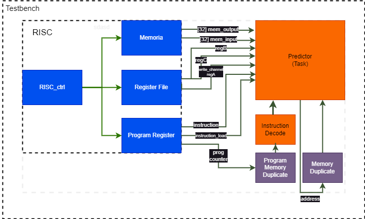

# Onecycle RISC
**Link to testbenchs**

Random: https://www.edaplayground.com/x/RpRp

Target: https://www.edaplayground.com/x/S62Q

Some important notes:
- register memory is pre-loaded with progressive natural numbers. That is, reg[0] = 0, reg[1] = 1, reg[2] = 2, ....
- reg[30] = reg[31] = FFFFFFFFF
- the instruction memory is also preloaded with all operations in the following order: logic (T=10), arithmetic (T=11), movement (T=00), flow ctrl (T=01)

## Target testbench

#### Instructions executed:
|Operation  |Operand 1|Operand 2|Operand 3|
|---------  |---------|---------|---------|
|**or**     |31       |0          |1
|**inv**    |31       |           |2
|**and**    |31       |4          |5
|**add**    |31       |31         |30
|**sub**    |31       |29         |28
|**addc**   |31       |27         |26
|**subc**   |31       |25         |24
|**load**   |31       |23         |22
|**store**  |21       |20         |19
|**loadi**  |31       |           |18
|**storei** |31       |           |17
|**jump**   |2        |           |
|**bz**     |1        |0          2
|**bnz**    |2        |1          2
|**bc**     |1        |30         |1
|**bv**     |1        |30         |0
|**jal**    |31       |3          
|**jral**   |31       |0          2
|**ret**    |18       |           |

## Randomized testbench
The testbench is designed to rigorously test a RISC (Reduced Instruction Set Computer) processor by generating random instructions and data inputs. Key components of the testbench include the RISC control unit, memory, register file, program register, and prediction task unit.

